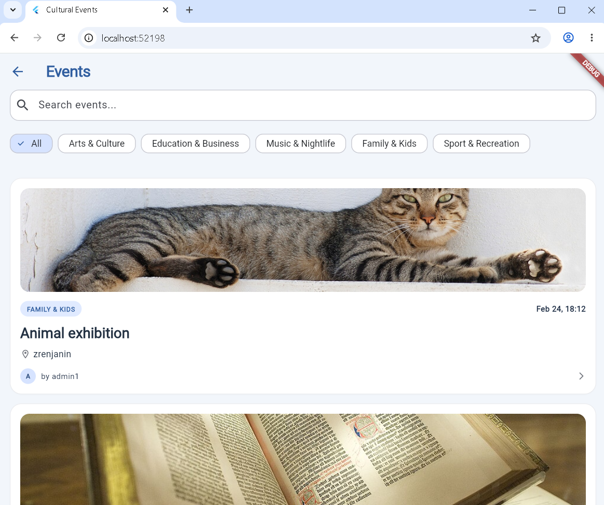

# CultureConnect

**CultureConnect** is a Flutter mobile application for discovering, creating, moderating, and joining cultural events. It helps communities centralize event discovery while giving organizers and administrators a structured workflow for publishing events, managing categories, and keeping event interaction safe through Firebase-backed authentication and rules.


## Tech Stack

- **Flutter** and **Dart** for the cross-platform mobile application
- **Firebase Authentication** for email/password sign-up, login, and session management
- **Cloud Firestore** for real-time event, user, category, registration, comment, and rating data
- **Firebase Security Rules** for role-based access control and protected event interactions
- **Firebase Cloud Functions** scaffold using **Node.js 20** and the Firebase Admin/Functions SDKs
- **Riverpod** with code generation for state management and dependency injection
- **GoRouter** for declarative navigation and route protection
- **Dio** for HTTP networking
- **OpenWeatherMap APIs** for geocoding and current weather data
- **Android**, **Web**, and Firebase platform configuration generated by FlutterFire
- **flutter_lints**, **build_runner**, and generated Riverpod providers for maintainable development workflows

## Key Features

- **User authentication** with Firebase email/password registration, login, logout, and persisted auth state.
- **Role-aware routing** for guests, standard users, and administrators.
- **Event discovery** with real-time Firestore streams, category filtering, status filtering, and local search across titles and descriptions.
- **Event creation and editing** with category assignment, location data, image URL support, and pending/approved/rejected moderation states.
- **Admin dashboard workflow** for approving, rejecting, and managing submitted events.
- **Category management** with event counters and delete protection for categories already assigned to events.
- **Event registration system** with per-user registrations and a dedicated "My Registrations" view.
- **Participant management** for viewing event attendees.
- **Comments and ratings** on approved events, including per-user rating records and aggregate rating statistics.
- **Weather and geocoding integration** using OpenWeatherMap to enrich event location context.
- **Offline-friendly Firestore setup** with local persistence enabled in the Flutter app.
- **Light and dark themes** with a centralized app theme and color system.

## Getting Started / How to Run Locally

### Prerequisites

Install the following tools before running the project:

- [Flutter SDK](https://docs.flutter.dev/get-started/install) compatible with Dart SDK `^3.11.0`
- Android Studio or VS Code with Flutter/Dart tooling
- A configured Android emulator, physical Android device, or supported web browser
- [Firebase CLI](https://firebase.google.com/docs/cli)
- [Node.js 20](https://nodejs.org/) for the Firebase Functions workspace

### 1. Clone the repository

```bash
git clone <your-repository-url>
cd MobilnaAplikacija/cultural_events_app
```

### 2. Install Flutter dependencies

```bash
flutter pub get
```

### 3. Install Firebase Functions dependencies

```bash
cd functions
npm install
cd ..
```

### 4. Configure Firebase

Log in to Firebase and connect the app to your own Firebase project:

```bash
firebase login
firebase use <your-firebase-project-id>
```

If you need to regenerate Firebase platform configuration, run:

```bash
flutterfire configure
```

The project expects Firebase configuration files such as:

- `lib/firebase_options.dart`
- `android/app/google-services.json`
- `firebase.json`
- `firestore.rules`

Do not commit private service account files or production-only credentials.

### 5. Configure environment variables and API keys

The app integrates with OpenWeatherMap for geocoding and current weather. Use your own API key and keep secrets out of source control for production builds.

Example local configuration values:

```bash
OPENWEATHER_API_KEY=<your-openweathermap-api-key>
FIREBASE_PROJECT_ID=<your-firebase-project-id>
```

If you refactor the app to load runtime configuration from Dart defines, you can run it like this:

```bash
flutter run --dart-define=OPENWEATHER_API_KEY=<your-openweathermap-api-key>
```

### 6. Generate Riverpod code when providers change

Generated files are already present in the workspace, but run this after editing annotated providers:

```bash
dart run build_runner build --delete-conflicting-outputs
```

### 7. Start the app

Run on the default connected device:

```bash
flutter run
```

Run on Chrome for web development:

```bash
flutter run -d chrome
```

Run on a specific Android emulator or device:

```bash
flutter devices
flutter run -d <device-id>
```

### 8. Deploy Firestore rules

After reviewing the security rules for your Firebase project, deploy them with:

```bash
firebase deploy --only firestore:rules
```

### 9. Optional: Deploy Firebase Functions

The Functions workspace is scaffolded and ready for future backend automation. When functions are implemented, deploy them with:

```bash
firebase deploy --only functions
```

## Project Structure

```text
cultural_events_app/
|-- android/                  # Android platform project and Firebase config
|-- functions/                # Firebase Cloud Functions workspace
|-- lib/
|   |-- core/                 # Shared routing, theme, services, validation, providers
|   |-- features/
|   |   |-- auth/             # Authentication, users, roles, profile screens
|   |   |-- categories/       # Category domain and Firestore repository
|   |   |-- events/           # Event domain, repository, screens, comments, ratings
|   |   `-- home/             # Home screen
|   `-- main.dart             # Firebase initialization and app entry point
|-- test/                     # Flutter widget tests
|-- web/                      # Web app shell and icons
|-- firebase.json             # Firebase project configuration
|-- firestore.rules           # Firestore security model
`-- pubspec.yaml              # Flutter dependencies and project metadata
```

## Quality Checks

Run static analysis and tests before opening a pull request:

```bash
flutter analyze
flutter test
```

## Notes for Reviewers

This project demonstrates a full-stack mobile architecture with real-time data, authenticated user flows, admin moderation, role-aware Firestore security rules, generated state-management providers, and external API integration. The codebase is organized by feature so product areas such as authentication, event management, and categories can evolve independently while sharing common infrastructure through the `core` layer.
